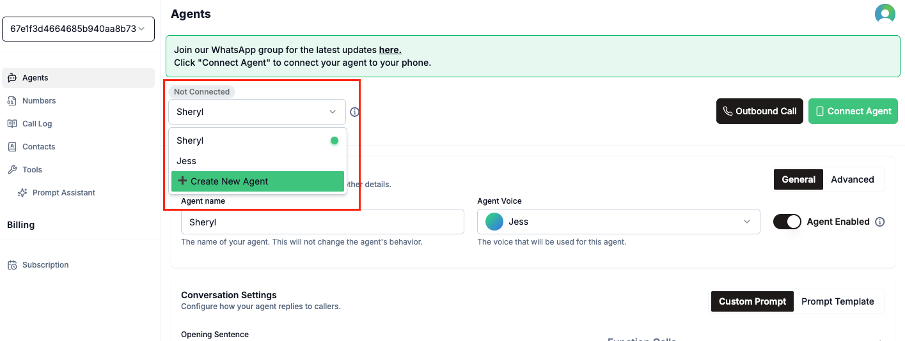
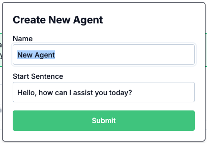

It's time to give your agent some personality and a role in the universe!

## Create Multiple Agents

You can create multiple agents within your Voqo AI dashboard to handle different business needs. Set up dedicated agents for inbound calls, outbound campaigns, or specific departments—giving you the flexibility to tailor your AI presence for every scenario.

*List and create multiple agents.*

*Name and write a start sentence for the new agent.*

## Agent General Settings
In the agent general settings section you can update:
- Your Agent's name
- Agent Voice (choose from our collection of 6 male and female voices!)
- Whether to enable or disable your agent (if you disable the agent, it will not respond to calls)

<iframe width="560" height="315" src="https://www.youtube.com/embed/ui_zgXcDrss?si=3iGNLTyHvxx4iWG9" title="YouTube video player" frameborder="0" allow="accelerometer; autoplay; clipboard-write; encrypted-media; gyroscope; picture-in-picture; web-share" referrerpolicy="strict-origin-when-cross-origin" allowfullscreen></iframe>

## Agent Advanced Settings
In the agent advanced settings section you can update:
- The AI LLM model you want to use for your agent
- The Timezone you want your agent to be within the context of
- Ambient background noise from the Agent's side.
- Whether calls should be recorded or not.
- Whether the agent should be interruptible or not.
- The speed of the agent's speech.
- The specialised keywords for improved agent transcription and understanding of the caller's speech.
