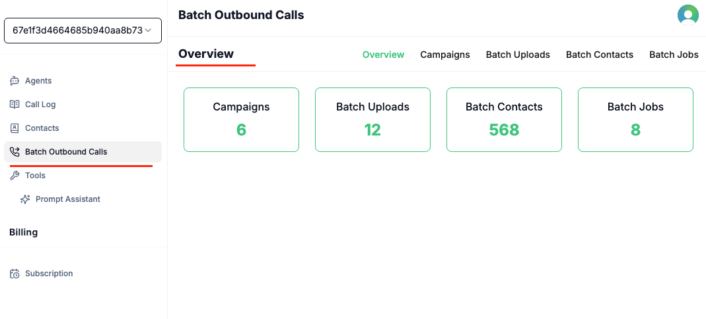

The **Batch Outbound Calls** feature enables you to initiate multiple outbound calls simultaneously using your configured Voqo AI agents. This is ideal for sending notifications, conducting surveys, or delivering personalized messages to a large list of recipients efficiently.

### Quick Overview

<CardGroup>
  <Card title="Campaigns" icon="bullhorn" href="Campaigns">
    Organize and manage your outbound calling campaigns, track progress, and analyze results.
  </Card>
  <Card title="Batch Uploads" icon="upload" href="Batch Uploads">
    Upload recipient lists in CSV or XLS format for bulk calling.
  </Card>
  <Card title="Batch Contacts" icon="address-book" href="Batch Contacts">
    Manage and review all contacts included in your batch call campaigns.
  </Card>
  <Card title="Batch Jobs" icon="list" href="Batch Jobs">
    Monitor the status and details of each batch call job, including reporting and outcomes.
  </Card>
</CardGroup>

## How It Works

1. Click **Batch Outbound Calls** on the sidebar to access the overview dashboard, where all components are managed in one place.
2. Create a new **Campaign** to define the purpose and parameters of your outbound calls.
3. Upload a list of recipients in CSV or XLS format.
4. After upload, view and manage the list of recipients to ensure accuracy.
5. Create a **Batch Job** by selecting the agent, campaign, batch upload, and number to initiate the outbound calls.

*Overview dashboard for managing all batch outbound call components.*

## Key Features

- **Upload recipient lists**: Easily upload recipient lists in CSV or XLS format.
- **Dynamic variables**: Personalize calls by including dynamic variables (e.g., `user_name`) in your recipient list as separate columns.
- **Agent selection**: Choose the specific Voqo AI agent to handle the calls.
- **Detailed reporting**: View comprehensive details of completed batch calls, including individual call recipient information.

## Concurrency

When batch calls are initiated, the number of concurrent active calls is constrained by our suppliers' quotas. Please contact us for detailed information regarding concurrency limits.

## Requirements

- A Voqo AI account with at least one agent set up.
- A phone number purchased through a paid subscription or as an extra number.