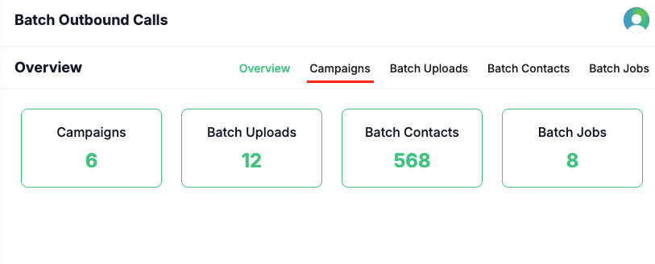
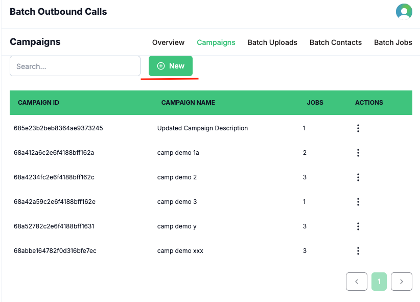
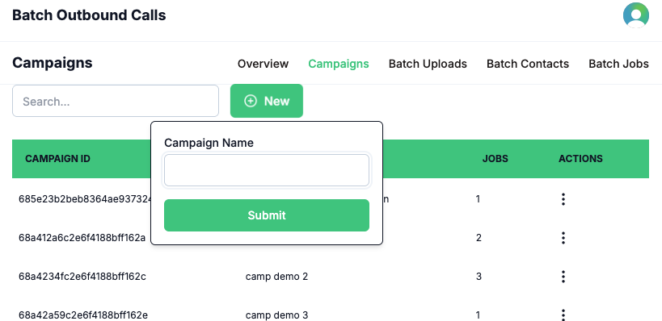
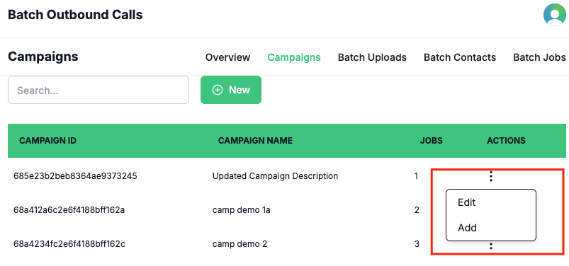

A **Campaign** in Voqo AI serves as an abstract grouping that maps to your real-world marketing or outreach initiatives. Campaigns provide a structured way to organize, manage, and track your batch outbound calls, ensuring clarity and efficiency as you scale your communication efforts.

By associating each batch of outbound calls with a specific campaign, you can easily monitor progress, analyze results, and maintain a clear overview of your ongoing and past activities.

## How It Works

1. Click the **Campaigns** button in the navbar to view a list of all created campaigns.

2. To create a new campaign, click the **New Campaign** button.

3. Enter a name for your campaign in the required input field and submit.

4. To update an existing campaign, use the action menu (three dots) on the right side of each campaign row to access editing options.

This streamlined workflow helps you keep your batch outbound calling efforts organized and aligned with your business objectives.