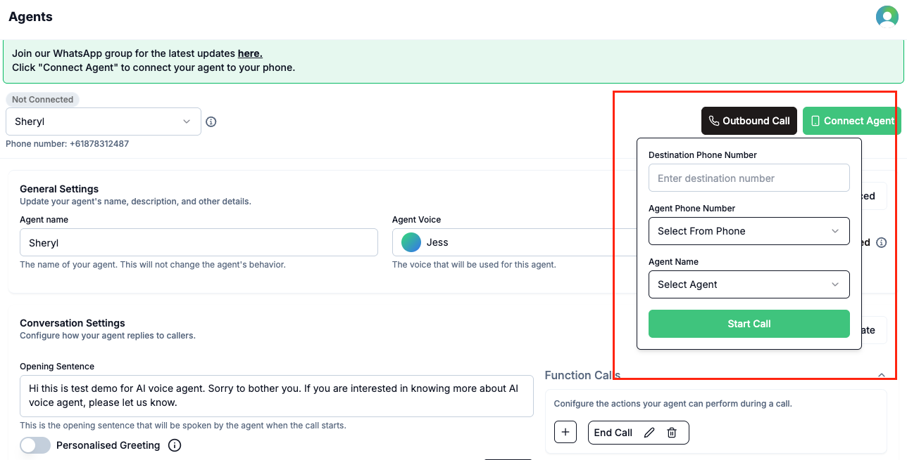

The **Individual Outbound Call** feature allows you to initiate one-off calls to any phone number directly from the Voqo AI platform, leveraging your AI agents for personalized outreach, follow-ups, or customer engagement.

## How It Works

1. Log in to your Voqo AI dashboard.
2. Click **Outbound Call** button on the top right corner.
3. Enter the recipient’s phone number.
4. Select the agent you want to use for the call.
5. Select the numbers you would initiate the call.
6. Initiate the call—your chosen AI agent will handle the conversation and follow any configured prompts or workflows.
7. After the call, review the call summary, transcript, and recording (if enabled) in the call logs.

*Making an individual outbound call via click 'Outbound Call' button.*

## Use Cases

- **Customer Follow-Up**: Reach out to customers after a recent interaction or purchase.
- **Appointment Reminders**: Have your AI agent remind clients of upcoming appointments or bookings.
- **Sales Outreach**: Make targeted outbound calls to prospects or leads for sales campaigns.
- **Service Notifications**: Notify customers about service updates, renewals, or important information.
- **Personalized Engagement**: Deliver tailored messages or check-ins to high-value clients.