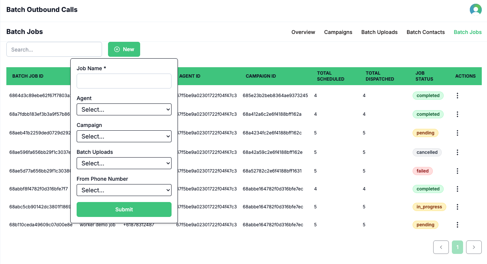
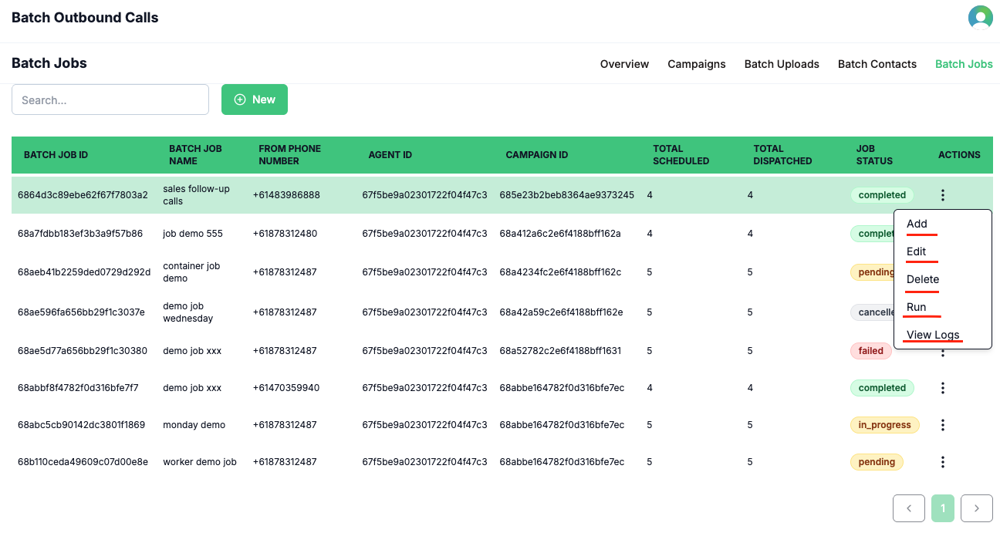

A **Batch Job** is the final step in launching a batch outbound call campaign. It brings together your selected campaign, agent, batch upload (list of contacts), and phone number to create and execute a coordinated batch calling operation. Batch jobs provide a clear overview of job status, management actions, and access to detailed reports.

You can monitor the status of each running job via the job status field. The three-dot action menu for each job allows you to add, edit, delete, or run jobs. Once a job is completed, you can download a detailed job report using the **View Logs** option.

## How It Works

1. Click the **New Job** button to start creating a batch job.  
  
2. Enter a name for your batch job.  
 
3. Select the agent you want to use for this batch call.  
  
4. Choose the campaign to associate with this job.  
   
5. Select the batch upload (list of contacts) for the job.  
  
6. Select the phone number to initiate the batch calls.  
   
7. After the job is completed, download the job report by clicking **View Logs**.  
   

This workflow ensures you can efficiently launch, monitor, and review your batch outbound calling campaigns with full control and transparency.