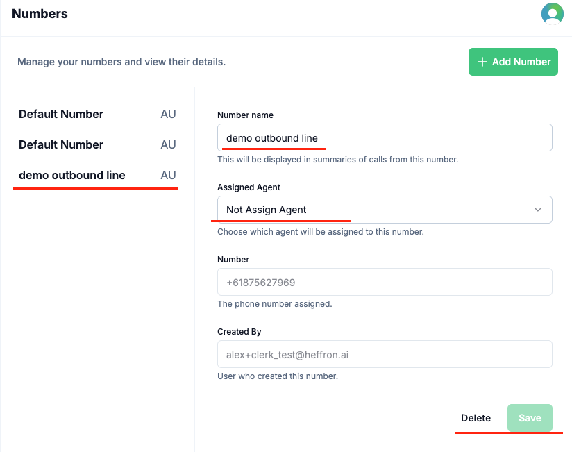

## Key Benefits

- Centralized management of all your business phone numbers
- Easily purchase additional numbers for AU and US markets
- Add, delete, or update numbers as your needs evolve
- Assign numbers to specific agents or leave unassigned for flexible routing
- Streamline operations by managing multiple lines in one place
- Paid subscribers receive a complimentary **Default Number**; extra numbers incur a recurring monthly fee

## How It Works

1. Log in to your Voqo AI dashboard.
2. Navigate to https://platform.voqo.ai/numbers or select “Numbers” from the sidebar.
3. The page displays a list of all numbers associated with your account.
4. Click **Add Number** and select your desired country (AU or US).
5. Complete the purchase and assign the number to an agent if desired, or leave it unassigned for later use.
6. Manage your numbers list with options to update details, reassign, or delete as your business requirements change.

*Numbers management page showing all purchased numbers.*

*Add Number form for naming,binding agents and selecting country options.*

*View and update number details.*

## Use Cases

- **Business Segmentation**: Set up dedicated lines for different departments or market segments
- **Inbound/Outbound Flexibility**: Use specific numbers for inbound support or outbound sales campaigns
- **Scalable Operations**: Add or remove numbers as your team grows or business needs shift
- **Agent Assignment**: Bind numbers to agents for direct routing, or keep numbers unassigned for shared use