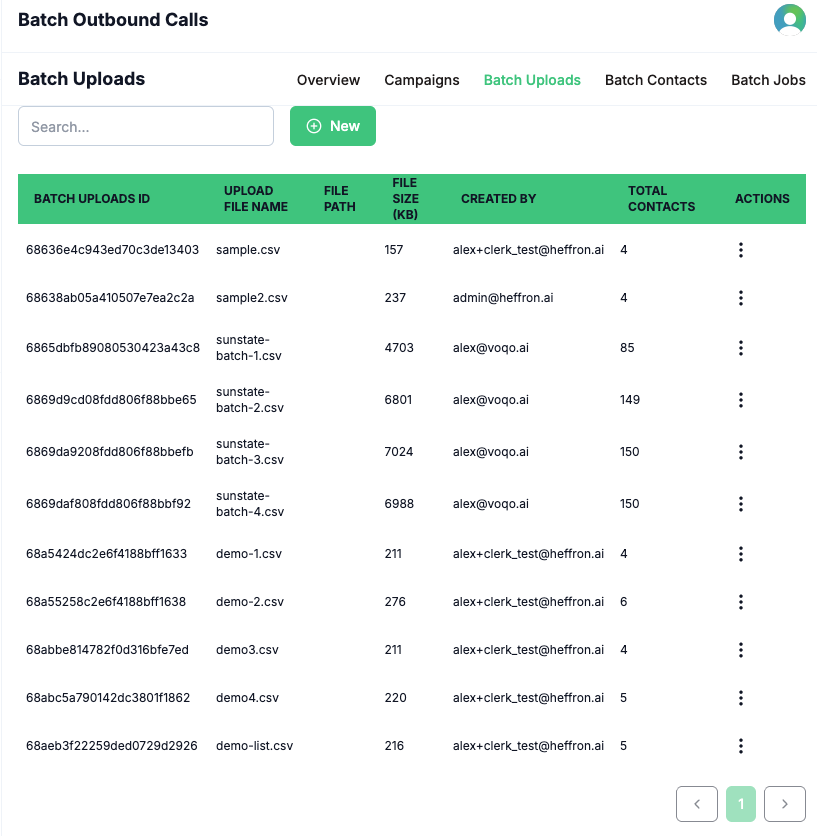
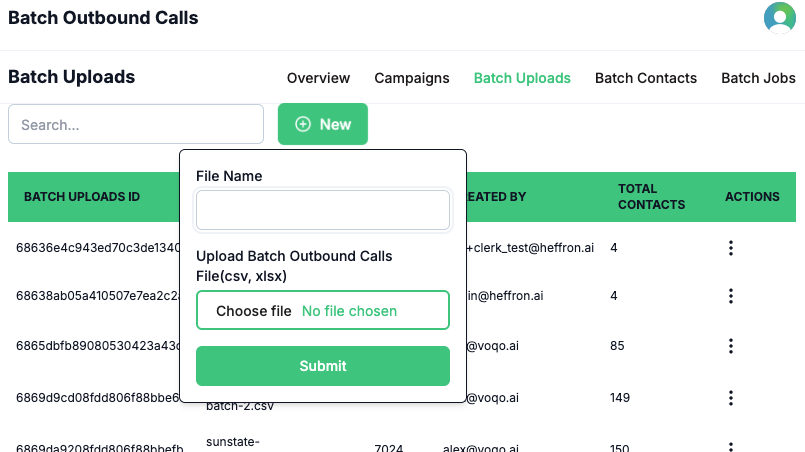
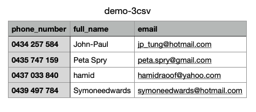

**Batch Uploads** allow you to import a list of recipients for your outbound calling campaigns. Each upload can include dynamic parameters—such as name, department, or job position—which are mapped to agent prompts, enabling your AI agent to personalize conversations for each recipient. This makes every interaction more relevant and engaging.

Each batch upload contains important metadata, including the file name, file size, and the total number of contacts in the upload. Organizing your uploads with clear, descriptive names helps you easily track and manage your campaigns.

## How It Works

1. Click the **Batch Uploads** button in the sidebar to view all your uploaded recipient lists.
   
2. To add a new upload, click the **New/Add** option in the three-dot action menu.
   
3. Enter a name for your upload (it is recommended to use a unique name that matches the uploaded file, including the extension, e.g., `list1.csv`, `list2.xlsx`).
   
---
title: 'Batch Contacts'
description: 'View all contacts included in your batch uploads for outbound calling campaigns in Voqo AI.'
---

The **Batch Contacts** page provides a comprehensive view of all contacts included in your uploaded recipient lists for batch outbound calls. This page is designed for easy reference and review—no manual operations are required here.

You can see detailed information for each contact, including dynamic parameters such as name, department, job position, and any other fields included in your upload. This helps ensure your campaigns are well-organized and that each recipient’s information is accurate and ready for personalized outreach.

*All uploaded contacts are displayed for review and reference.*
4. Upload your recipient file from your local system (CSV or XLSX format).
<Warning>
### Important Notes about batch uploading
* The file must be a csv/xlsx file.
* Input file name is recommended to be unique and mapping to the file name
* List headers must contain phone_number, the other headers can be any.
</Warning>

Once uploaded, you can view the metadata for each batch upload, including file name, file size, and total contacts. Dynamic parameters in your file will be available for use in agent prompts, allowing for highly personalized outbound calls.

This workflow ensures your recipient lists are well-organized and your campaigns are set up for maximum personalization and efficiency.